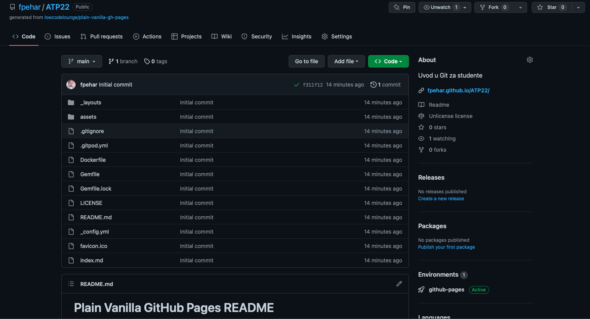

[O nama](./onama.html)

# Plain Vanilla GitHub Pages

Svrha ovog projekta je izraditi jednostavne stranice uz pomoć [GitHub Pages](https://pages.github.com/).

## Kako funkcionira

Nakon što smo izradili site na temelju postojeće kopije s jednog repozitorija, nove stranice možete dodati koristeći Markdown (.md) format. Više informacija možete pronaći na [GitHub Flavored Markdown](https://guides.github.com/features/mastering-markdown/).

Ako vam je potrebno više od jednostavnih funkcionalnosti koje nudi Markdown, interaktivne elemente, poput botuna i sl., možete kopirate sa [GitHub Primer components](https://primer.style/css/components) na vlastitu stranicu.

<a href="https://github.com/lowcodelounge/plain-vanilla-gh-pages" class="btn-mktg btn-large-mktg">Preuzmite predložak na GitHub</a>
   

